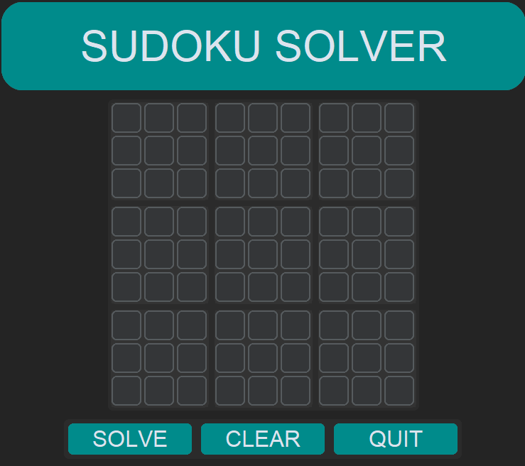
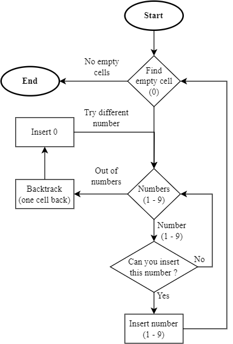

# Sudoku Solver

Application for solving 9x9 sudoku.

## Functionality

Solving process uses backtracking principle while trying to insert every number until it finds the correct solution. Empty cells are represented by 0 while finding a solution.

GUI was made with CustomTkinter.

*Image: Flowchart of solution finding algorithm.*
